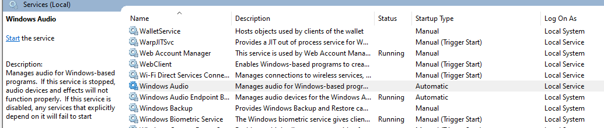
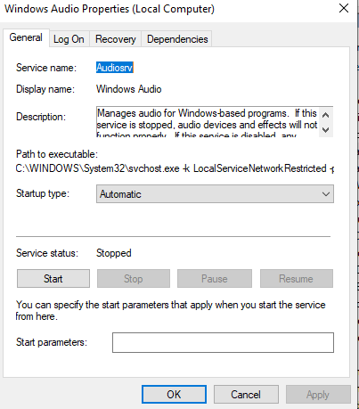

# Ticket 002: No audio output

**Date:** 2026-09-22
**Category:** OS / services
**Priority:** Medium
**Environment:** Windows 10 Home, local workstation

## Reported issue
Audio not playing from speakers. Only visible message from the application Spotify, just simply says the program can't currently play audio. Speaker icon in the taskbar currently has red 'X' displayed, as well as when mouse hovers over icon the message 'The Audio service is not running' appears. 

## Environment setup
The Windows Audio service was intentionally stopped to provide a scenario of the audio not working as intended. 

## Troubleshooting steps
1. Confirmed speakers were not set to 'mute'
2. Opened Services and located Windows Audio
3. Confirmed the service status showed Stopped

4. Opened Properties and confirmed Startup type was set to Automatic

5. Clicked Start and confirmed the status changed to Running
6. Played audio to verify sound had returned

## Root cause
The Windows Audio service had been stopped and just needed to be started.

## Resolution
Within Windows Audio service, changed service status to Start. Made sure startup type was set to Automatic.

## Time to resolve
5 minutes

## Prevention and user education
Users can be shown how to check Windows services to see if services have a running status before escalating. A stopped service is a common cause of "feature X suddenly doesn't work", and Automatic startup means it should come back after a reboot. 

## Notes
Standard users can open Services and view a service's status and startup type, but starting or stopping a service requires administrative rights. The speaker icon's hover text ("The Audio service is not running") is a useful first clue that points directly at the service rather than the
hardware.
