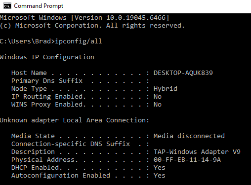
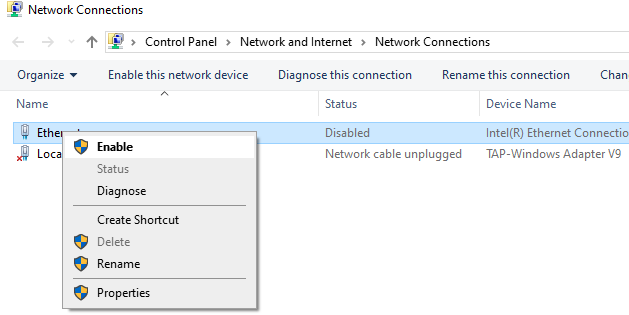
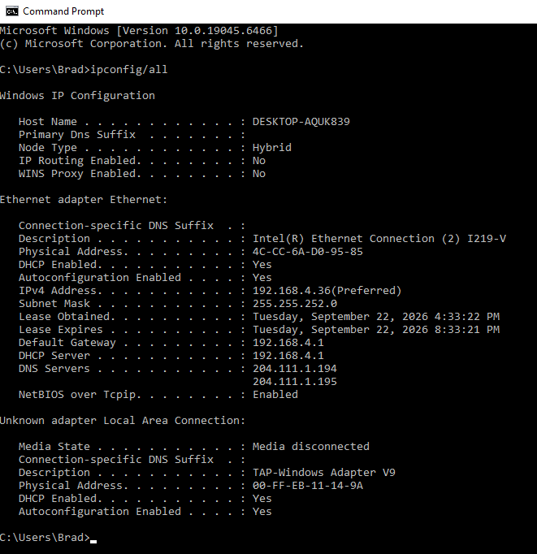

# Ticket 003: No network connectivity

**Date:** 2026-09-22
**Category:** Networking
**Priority:** High
**Environment:** Windows 10 Home, local workstation

## Reported issue
Network not responding. Attempting to load a webpage results in error 'Internet Disconnected'. Network icon in taskbar states 'Not connected - No connections are available'.

## Environment setup
The network was intentionally disabled to simulate a period of no connectivity. Websites were attempted to load, and ipconfig /all was used in command prompt to see a before and after of having the network enabled. 

## Troubleshooting steps
1. Confirmed the lack of connectivity of the network 
2. Opened Command Prompt and ran `ipconfig /all`. The Ethernet adapter
   showed "Media disconnected" with no IP address, default gateway, or
   DNS servers assigned.
3. Clicked on the network taskbar icon, then clicked on Network & internet settings
4. Clicked on status, saw that my network was not listed in 'Show available networks' list
5. Went into Control Panel > Network and Internet > Network Connections, noticed my Ethernet status was disabled. 
6. Enabled the Ethernet
7. Opened Command prompt and ran 'ipconfig /all', to verify network was now connected. 

## Root cause
The Ethernet adapter was administratively disabled in Windows, preventing the system from obtaining an IP address or reaching the network. The physical connection and hardware were unaffected.

## Resolution
Went into Control Panel > Network and Internet > Network Connections and set Ethernet status to Enable

## Time to resolve
15 min

## Prevention and user education
Users can check the network icon in the taskbar and confirm the cable is securely connected at both ends. Enabling a disabled adapter requires administrative rights and should be escalated to IT.

## Notes
Enabling a network adapter requires administrator rights, so a standard user can see the problem but not fix it. A faster route that bypasses Control panel clicks is Windows key + R, then ncpa.cpl, opens Network Connections directly.
