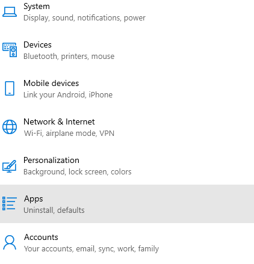
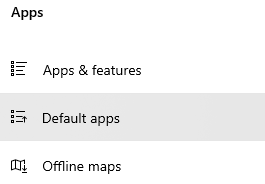
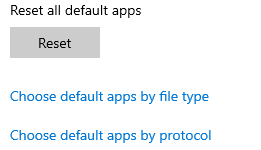
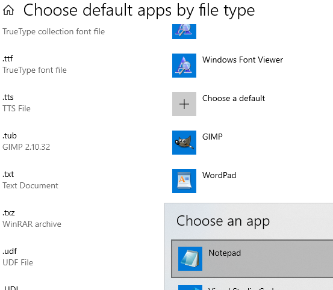

# Ticket 004: Files opening in the wrong program

**Date:** 2026-09-22
**Category:** OS / applications
**Priority:** Medium
**Environment:** Windows 10 Home, local workstation

## Reported issue
When attempting to open a text file, the wrong program runs and tries to open said file. 

## Environment setup
A test text file was created on windows desktop. Chose to open file with 'WordPad', this caused all text files to now be opened with 'WordPad' rather than 'Notepad'.   

## Troubleshooting steps
1. Verified what program the text file runs in by double clicking the text file to open it. 
2. Opened Settings > Apps > Default Apps 

3. Clicked 'Choose default apps by file type', and scrolled down to .txt 
4. WordPad is set as default app for .txt files
5. Clicked WordPad, this opened up a list of apps to choose from. 
6. Chose Notepad as the default app for .txt files. 

## Root cause
The default program had been changed for a single .txt file, this caused the chosen program to now be the default for all .txt files. 

## Resolution
Went into Settings > Apps > Default Apps, changed the default app for .txt files to Notepad.

## Time to resolve
10 min

## Prevention and user education
Users can try opening with a different program by right-clicking on the file. Then selecting 'Open with', and then selecting the program they want to use. If the file doesn't open properly then the selected program may not be compatible and another program will need to be chosen.

## Notes
When trying to open a file with a specific program using right-click and 'open with', users must be aware that that program will now be the default for opening all files of that type. 

