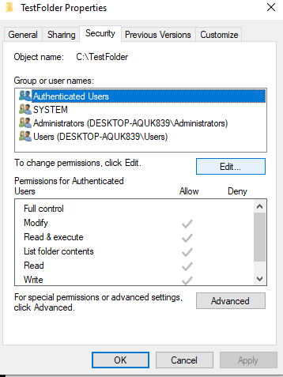
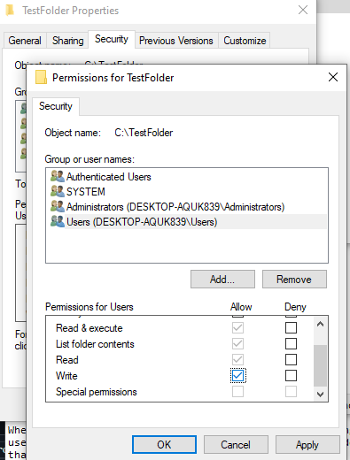

# Ticket 005: Access denied when saving to a folder

**Date:** 2026-09-22
**Category:** Permissions
**Priority:** High
**Environment:** Windows 10 Home, local workstation

## Reported issue
When attempting to save a file to the folder 'C:\TestFolder', user is denied the ability to save to that folder. Error message claims user does not have the permission needed to perfrom action. 

## Environment setup
Created a folder and saved a .txt file within. Then changed the Users permissions of the folder to deny on 'Write' action. Created a second .txt file to save to same folder and was denied ability to do so.    

## Troubleshooting steps
1. Tried creating a new file and saving to the folder: 'C:\TestFolder'
2. Right-clicked on folder and chose Properties
3. Choose the Security Tab 
4. Be sure to select 'Users' under Group or user names
5. In the permissions for Users area, check for the action 'Write' and determine if Allow or Deny is selected. 
6. Deny was checked, so click on Edit. 
7. Again, be sure to select 'Users' under Group or user names. Then beside the 'Write' action, check the Allow box. 

## Root cause
The permission of the 'C:\TestFolder' for the 'Write' action had been selected to Deny for the Users group. 

## Resolution
Went into 'C:\TestFolder' > Properties > Security, and changed the Users group Write permission to Allow.

## Time to resolve
10 min

## Prevention and user education
Users can verify the permission by looking into the properties of a folder, simply checking between Allow or Deny can fix a quick permission issue that was caused in error. 

## Notes
Deny always overrides Allow, so a single deny entry can block someone even when other permissions grant access.
